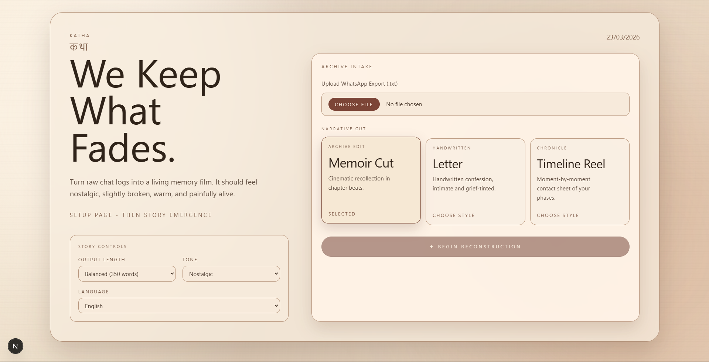

# katha

[](./.github/workflows/ci.yml)
[](./LICENSE)
[](https://nextjs.org/)
[](https://www.typescriptlang.org/)

**कथा**

Turn exported chat logs into cinematic memoirs with customizable tone, chaptered output, translation, and text-to-speech.

## Features

- Nostalgic two-scene flow: setup -> generation -> chapter carousel
- Narrative formats: `memoir`, `letter`, `timeline`
- Output length presets up to 2000 words
- Tone presets for emotional style control
- Sarvam-powered translation and TTS
- PDF export and audio download

## Screenshots

Place the provided images at:

- `docs/assets/setup-screen.png`
- `docs/assets/loading-screen.png`

Then these render in GitHub automatically:




## Tech Stack

- Next.js 16 (App Router)
- React 19
- TypeScript
- Tailwind CSS 4
- GSAP + Anime.js
- jsPDF

## Project Structure

```text
frontend/
  src/
    app/
    components/
  public/
  docs/
    assets/
  .github/
```

## Local Setup

```bash
npm install
npm run dev
```

Runs at `http://localhost:3000`.

## Backend Contract

Frontend expects backend at `http://127.0.0.1:8000` with:

- `POST /api/generate-story`
- `GET /api/capabilities`
- `POST /api/sarvam/translate`
- `POST /api/sarvam/tts`

See [docs/backend.env.example](docs/backend.env.example) for backend environment variables.

## Quality Checks

```bash
npm run lint
npm run build
```

## Open Source

- [MIT License](LICENSE)
- [Contributing Guide](CONTRIBUTING.md)
- [Code of Conduct](CODE_OF_CONDUCT.md)
- [Security Policy](SECURITY.md)
